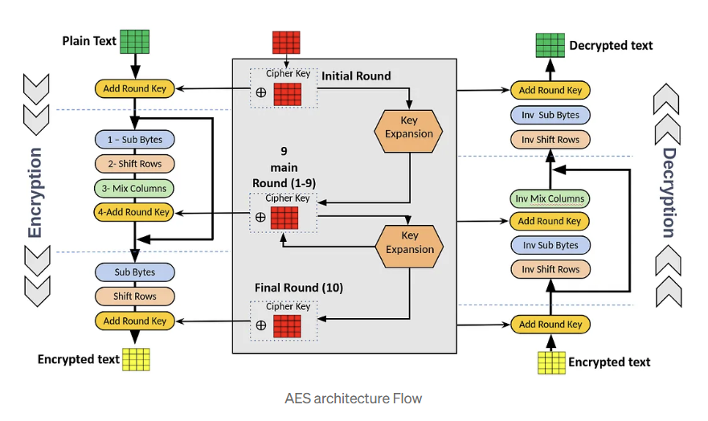

# AES Crypto Core - 64-bit AES with Data Splitting, Multiple Keys & Scoreboard

## 📌 Overview
This project implements a **64-bit AES encryption and decryption system** in Verilog, extended with a **data splitter** for 128-bit inputs and **support for multiple keys**.  
It also includes a **scoreboard-based verification environment** to ensure encryption-decryption correctness.

## 🔹 Key Features
- **AES Core Modules**
  - SubBytes & InvSubBytes
  - ShiftRows & InverseShiftRows
  - MixColumns & InvMixColumns
  - AddRoundKey
- **Data Splitter & Joiner**
  - Splits 128-bit input into two 64-bit halves for parallel AES encryption.
  - Combines two decrypted halves into a 128-bit output.
- **Multiple Key Support**
  - Allows each 64-bit half to be encrypted with a unique key.
- **Scoreboard Mechanism**
  - Automated verification of encryption-decryption results.
- **FIFO Integration**
  - For storing and processing intermediate data.

## 📂 Project Structure

├── AES_Encrypt.v # Top-level AES encryption module
├── Decryption.v # Top-level AES decryption module
├── AddRoundKey.v # AddRoundKey operation
├── sub_bytes.v # SubBytes transformation
├── InvSubByte.v # Inverse SubBytes
├── ShiftRows.v # ShiftRows transformation
├── InverseShiftRows.v # Inverse ShiftRows
├── Mix_columns.v # MixColumns transformation
├── InvMixColumn.v # Inverse MixColumns
├── FIFO.v # FIFO buffer
├── ScoreBoard.v # Scoreboard for verification
│
├── aes.v # AES core integration
├── design.v # High-level design wrapper
│
├── AES_tb.v # AES encryption testbench
├── testbench.v # General-purpose testbench
├── unique_key_tb.v # Testbench for multiple unique keys
├── multiple_key_tb.v # Testbench for multiple key scenario
├── FIFO_tb.v # FIFO testbench

## 🔹 How It Works
### 1. **Encryption Flow**
1. Input 128-bit plaintext.
2. Data splitter divides into two 64-bit blocks.
3. Each block is encrypted via AES core (can use same or different keys).
4. Encrypted blocks are combined into a 128-bit ciphertext.

### 2. **Decryption Flow**
1. Input 128-bit ciphertext.
2. Splits into two encrypted halves.
3. Each block is decrypted via AES decryption core.
4. Outputs the original 128-bit plaintext.

### 3. **Scoreboard**
- Compares decrypted output with original plaintext.
- Reports pass/fail for each test case.

## AES Encryption Process Diagram

